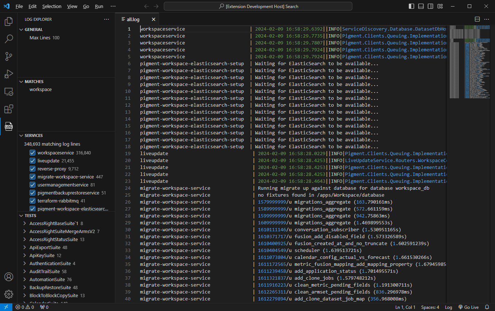

# Log Explorer

Log Explorer lets you easily navigate through your big log files.

## Features

- Load a controlled amount of lines
- Filter lines that contain a specific string
- Filter services emitting logs
- Filter lines logged between the start and end of a specic test

## Requirements

On Windows, the extension requires access to WSL.

## Release Notes

### 0.0.1

Initial release of Log Explorer
